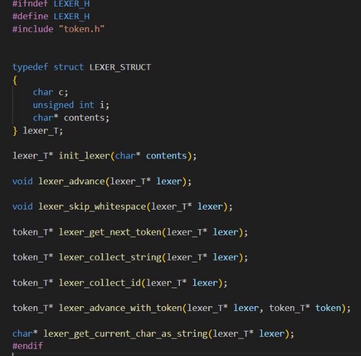
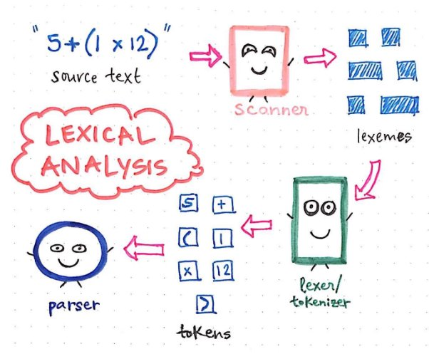
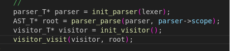
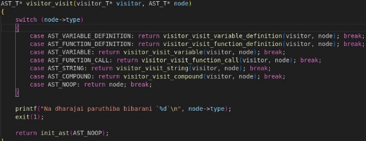

Making a language from scratch – “ODI-Lang” 

So, there I am making my 1st programming language. I'll be learning and try to maintain this documentation to make myself understand better and to make a note of what I'm doing and why.  

\>>I'll start with the definition of programming language. So, Programming language is a program that converts text (source code) into behaviour.  

First let's make one Folder  

- mkdir <your\_language\_name> (For me I'll be giving it odia) < 

Then get into that folder 

- cd odia < 

Then I'll make some files and folders inside it. Firstly, I'll make an MakeFile (It'll be an instruction to the compiler so that it knows how to compile your project) 

- touch MakeFile < 

\>mkdir src < 

\>mkdir src/include < 

Inside the src folder I'll gonna make main.c and inside the include I'll create main.h file 

\>touch src/main.c < 

\>touch src/include/main.h < 

Let's focus on MakeFile for now 

let's define the executable first >exec = odia.out 

\>sources = $(wildcard src/\*.c) (Because our src file are gonna be in the src folder and the extensions for the file is .c ) 

Now I'm gonna define how it should create objects... >objects = $(sources:.c=.o) 

\>flags = -g  

- $(exec): $(objects) 

gcc $(objects) $(flags) -o $(exec)  

Now I'am gonna tell this how to make .o files 

- %.o: %.c include/%.h 

gcc -c $(flags) $< -o $@ 

install: (I'am making this so that every time I don't need to call ./odia.out to run something) 

make 

cp ./odia.out /usr/local/bin/odia 

clean 

-rm \*.out -rm \*.o -rm src/\*.o 

Let's get into main.c now >#include <stdio.h> 

int main(int argc, char\* argv[]){ printf("Hello World!\n"); 

return 0; 

} 

- Now I have to run the command 
  - sudo make install < 
- After this you can get out put after just typing 'odia' in the terminal. So, it I just made the 'odia' binary accessible globally. 

Now now come to 'LEXER' (BECAUSE IT IS IMPORTANT)... 

Lexer :- It is a set of functions that knows how to turn your source code into tokens basically. First step of writing your own programming language.  

Eg: print(5+var); 

Here print-> id 

`     `( -> operator 

`     `5 -> num 

\+ -> operator & like that     

Parser and AST - Parser takes the tokens from Lexer and creates a AST (Abstract Syntax Tree)  

Visitor - Visitor gonna visit every nodes of the tree and perform operations based on what's in the tree 

Now I'll be making the Header for lexer... 

I'll be writing the first then after I'll be writing the expalnation beside it. 

- It's just a example explantion like lexer I have to create token.h also to set the tokens. 
- Now I will create lexer.c, token.c in src folder to write our logic.  
- And yes, compile every time after you write one function  
  - To compile: make < 

`      `make clean < 

- After that I will work on Parser and AST (Abstract Syntax Tree) 

\>So, what is parser basically does, it takes the tokens generated by Lexer and makes and Syntax tree out of it 

- Now make AST.h, parser.h and define their logic in AST.c, parser.c  
  - I have also done some changes to other files too so look into it also  
- Basically, what I have done that I made some parse functions that will check for the tokens and variables in the code and verify it using an expectation\_function so, if an unexpected token gets in then it'll give an error. (\*Fun part is that I got unexpected token error while writing the unexpected token error :) ) 
- Just a diagrammatic representation of how the program works 

- As it's not really possible to explain everything in the documentation so I have added comments  
- After parser and AST I started my work with visitor  
- Also, I have to add some new Tokens specifiers in the AST.h and Token.h that I have forgotten 
  - Let me show a part of main.c for easy understanding: 

`        `>So what happening here is that there's a lexer function which tokonizes the program then gives it to the parser and then the parser makes a AST out of it then the visitor visits each node to make the program work. 

- Now visitor.c have a reallyyy long code yet to make it simple I'll show the entry point of the visitor as an example 

  

- Anyone having the knowledge of switch case and functions can know that what's happening here. As per the the cases the function calling is happening. But it's a different thing that everything is a part of tree. 
- The initial functions were quite tough to write and understand but when I divided the lexer, parser and AST into certain divisions then it became quite easy. 
